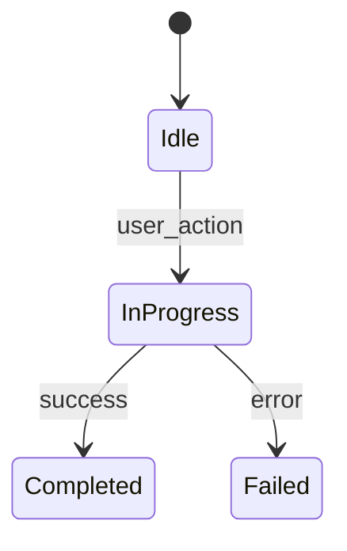

# Feature Design Spec — [Feature Name]

> **Category:** Technical & UX Design Specification  
> **Status:** 🟦 Draft <!-- or 🟢 Living -->  
> **Index:** [`docs/design-specs/README.md`](./README.md)  
> **Associated Epic:** [`docs/backlog/epic-X-NAME/EPIC-X-NAME.md`](../backlog/epic-X-NAME/EPIC-X-NAME.md)

---

## 1. Executive Summary & Problem Framing
[High-level overview of the feature, target operator workflow, and architectural role.]

---

## 2. User Experience & UI Component Hierarchy
[Visual layout, interaction flows, keyboard shortcuts, and state progression.]

```text
┌─────────────────────────────────────────────────────────────┐
│ Visual Wireframe / Component Hierarchy                      │
└─────────────────────────────────────────────────────────────┘
```

---

## 3. Data Contracts & State Machine

### Protocol Payload (Client ↔ Orchestrator)
```json
{
  "op": "feature_operation",
  "payload": {
    "key": "value"
  }
}
```

### State Transitions


---

## 4. Surface-by-Surface Technical Requirements
* **Mac Client (`mac-app/`)**: Views, ViewModels, stores, and coordinator hooks.
* **Orchestrator (`orchestrator/app/`)**: Routes, background tasks, database queries.
* **Database (`supabase/migrations/`)**: Tables, constraints, RLS policies.

---

## 5. Verification Strategy & Acceptance Criteria
* [ ] Unit test assertions
* [ ] Integration regression checks
* [ ] Visual/manual operator verification steps
