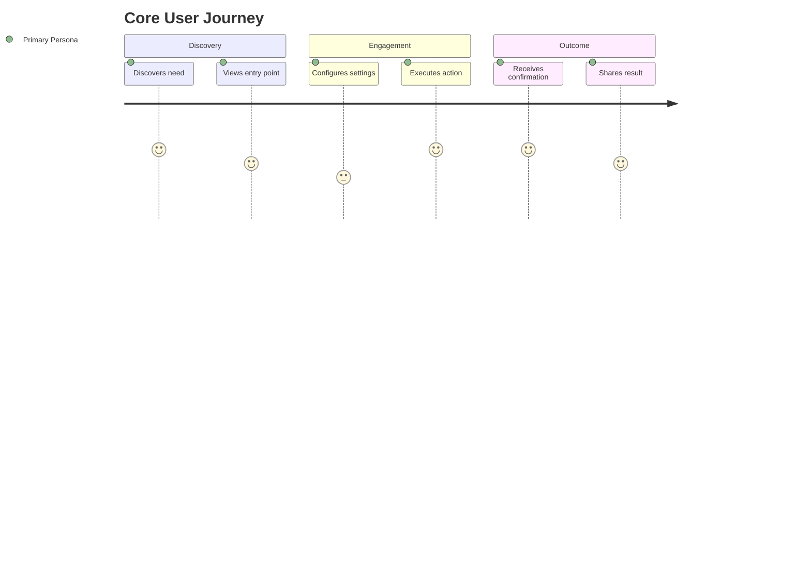

# Product Requirements Document (PRD) — [Initiative Name]

> **Category:** Product Requirements & Scope Specification  
> **Status:** 🟦 Draft <!-- 🟨 Review | 🟢 Approved | 🟣 Implemented -->  
> **Index:** [`docs/product/README.md`](./README.md)  
> **Target Epic:** [`docs/backlog/epic-X-NAME/EPIC-X-NAME.md`](../backlog/epic-X-NAME/EPIC-X-NAME.md)  
> **Owner:** [Product Owner / Lead]

---

## 1. Executive Summary & Problem Statement

### 1.1 The Problem
[Describe the customer pain point or market opportunity. What happens today without this feature?]

### 1.2 The Proposed Solution
[Concise summary of what we are building and how it addresses the core pain point.]

---

## 2. Target Personas & User Journeys

### 2.1 Target Personas
- **Primary Persona:** [Name / Role — e.g. Community Organizer, Platform Engineer]
- **Secondary Persona:** [Name / Role — e.g. End User, Compliance Officer]

### 2.2 Core User Journey

---

## 3. Product Goals & Success Metrics (KPIs)

| Metric | Baseline | Target Goal | Measurement Method |
|---|---|---|---|
| **Conversion Rate** | 0% | 15% | Analytics event tracking |
| **Task Completion Time** | 4.5 min | < 1 min | Session telemetry |
| **Error Rate** | N/A | < 1% | Error logging / APM |

---

## 4. Feature Scope & Requirements

### 4.1 Must-Have (P0 / MVP)
- [ ] **FR-01**: [Essential capability required for initial viable release]
- [ ] **FR-02**: [Essential capability required for initial viable release]

### 4.2 Should-Have (P1)
- [ ] **FR-03**: [High-value capability to be delivered immediately following MVP]

### 4.3 Nice-to-Have (P2)
- [ ] **FR-04**: [Delighter or optional optimization for future consideration]

### 4.4 Explicit Non-Goals (Out of Scope)
- 🚫 [Explicit boundary — what this initiative will NOT do]
- 🚫 [Explicit boundary — what is deferred to future milestones]

---

## 5. Non-Functional Requirements (NFRs)

- **Performance & Latency:** [e.g. Page loads under 200ms; background jobs complete in < 5s]
- **Security & Privacy:** [e.g. RLS multi-tenant isolation, encrypted secrets, GDPR compliance]
- **Accessibility (a11y):** [e.g. WCAG 2.1 AA compliance, keyboard navigation, aria-live announcements]
- **Scalability:** [e.g. Supports 10,000 concurrent active users]

---

## 6. Dependencies, Risks & Mitigations

| Risk / Dependency | Impact | Likelihood | Mitigation Strategy |
|---|---|---|---|
| [External API rate limits] | High | Medium | Implement caching & backoff retries |
| [Third-party vendor approval] | Medium | Low | Engage compliance team early |

---

## 7. Release & Rollout Strategy

1. **Internal Dogfooding:** Target Date: YYYY-MM-DD
2. **Private Beta / Canary:** Feature flag rollout to 5% of organizations.
3. **General Availability (GA):** Full rollout once error rates remain < 0.1% for 72 hours.
