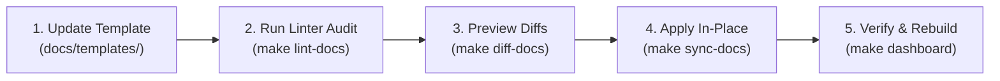

# Documentation Reconciliation & Template Evolution Runbook

> **Audience:** AI Coding Assistants, Software Architects, Engineering Leads & Operators  
> **Index Level:** User & Operator Guides (`docs/user-guides/`)  
> **Master Index:** [`docs/README.md`](../README.md)  
> **Governance Standard:** [`docs/architecture/15-DOCUMENTATION-AND-PLANNING-GOVERNANCE.md`](../architecture/15-DOCUMENTATION-AND-PLANNING-GOVERNANCE.md)  
> **Canonical Templates:** [`docs/templates/`](../templates/)  
> **Executable Engine:** [`scripts/reconcile_docs.py`](../../scripts/reconcile_docs.py)

---

## 1. Executive Summary & Purpose

As platform standards evolve, architectural requirements change, or AI coding assistant rules are refined, documentation templates in [`docs/templates/`](../templates/) undergo updates. In large multi-epic repositories like Agent OS, manual line-by-line editing across hundreds of files is slow, expensive in AI context tokens, and risks accidental clobbering of domain requirements, diagrams, and task completion states.

This runbook provides the standard, repeatable procedure for **linting and automatically reconciling active platform documentation** using the AST-based reconciler (`scripts/reconcile_docs.py` / `make sync-docs`).

---

## 2. Core Invariants & Preservation Guarantees

The reconciliation engine is strictly non-destructive and operates on an **AST payload-vs-envelope separation**:

* 📊 **Preserved**: 100% of existing technical designs, Mermaid sequence/flowchart diagrams, DDL schemas, endpoints, domain notes, and `[x]` / `[ ]` task states are kept verbatim.
* 🛠️ **Enforced**:
  - YAML frontmatter schemas (`id`, `title`, `type`, `status`, `surfaces`, `parent_epic`, `created`, `updated`).
  - Rewrites legacy path references (e.g. `docs/roadmap/` $\rightarrow$ `docs/backlog/`).
  - Injects missing mandatory governance tasks (`Task X.Y.5` Doc reconciliation, `Task X.Y.6` Session handoff).
  - Injects `### AI Self-Audit & Defect Remediation` into Section 4 with 6 non-negotiable checks.
  - Injects `## 5. Human Verification Procedure (Step-by-Step)` into stories missing operator click-through flows.
  - Injects `### Mandatory Acceptance Gate for Every Story`, `### Two-Tier Documentation Invariant`, and `### Mandatory 3-Phase Testing Protocol` into Epic plans.

---

## 3. The 5-Step Repeatable Evolution Workflow

Whenever a template in `docs/templates/` (e.g. [`STORY-TEMPLATE.md`](../templates/STORY-TEMPLATE.md) or [`EPIC-TEMPLATE.md`](../templates/EPIC-TEMPLATE.md)) is modified, follow this 5-step loop:



### Step 1: Update the Canonical Template
Make the desired change to the template file in [`docs/templates/`](../templates/). For example, adding a new required field to frontmatter or updating the AI Self-Audit checklist.

### Step 2: Run the Linter Audit (`make lint-docs`)
Detect drift across the backlog without modifying files:
```bash
make lint-docs
```
*If any files deviate, the command lists every drifting file and exits with non-zero status.*

### Step 3: Preview Diffs (`make diff-docs`)
Inspect the exact unified diffs proposed by the engine:
```bash
# Preview all proposed changes
make diff-docs

# Or preview a specific Epic
make diff-docs EPIC=30
```

### Step 4: Reconcile Documents (`make sync-docs`)
Apply structural alignment safely in place:
```bash
# Reconcile all in-progress and planned documentation
make sync-docs

# Or reconcile specific targets
make sync-docs EPIC=30
make sync-docs TARGET=stories STATUS=in_progress
```

### Step 5: Verify & Rebuild Dashboard
Confirm zero drift and refresh the offline interactive status dashboard:
```bash
make lint-docs
make dashboard
git diff --stat
```

---

## 4. Scoping Dimensions & CLI Reference

The reconciliation engine supports 4 independent, combinable scoping dimensions:

| Dimension | Makefile Variable | CLI Flag | Example Usage |
|---|---|---|---|
| **Status Filter** | `STATUS=...` | `--status` | `make sync-docs STATUS=in_progress` |
| **Epic Number** | `EPIC=...` | `--epic` | `make sync-docs EPIC=30` |
| **Epic List/Range** | `EPICS=...` | `--epics` | `make sync-docs EPICS=10,21,30` or `EPICS=20-25` |
| **Document Target** | `TARGET=...` | `--target` | `stories`, `epics`, `backlog`, `design-specs`, `adrs`, `prds`, `handoffs`, `all`, `all-docs` |
| **Direct File Path** | N/A | `--file` | `python3 scripts/reconcile_docs.py --fix --file "docs/design-specs/*.md"` |

### Target Scopes
* `backlog` / `stories` / `epics`: Scans stories and/or epics in `docs/backlog/` (filtered by status).
* `design-specs`: Scans feature and architecture UX specifications in `docs/design-specs/`.
* `adrs`: Scans Architecture Decision Records in `docs/adr/`.
* `prds`: Scans Product Requirement Documents in `docs/product/`.
* `handoffs`: Scans session handoffs in `docs/history/handoffs/`.
* `all` (default): Audits stories and epics across the backlog.
* `all-docs`: Comprehensive repository-wide audit covering all epics, stories, design specs, ADRs, PRDs, and handoffs.

---

## 5. Troubleshooting & Safety Tips

* **Always inspect `git diff`**: After running `make sync-docs`, run `git diff docs/backlog/` to confirm that all existing technical notes, diagrams, and task checkboxes are intact.
* **Non-destructive rollback**: If unintended changes occur during a template migration, simply run `git checkout docs/backlog/`.
* **CI Integration**: You can add `make lint-docs` to continuous integration pipelines or git pre-commit hooks to block PRs from merging specifications that deviate from platform templates.
